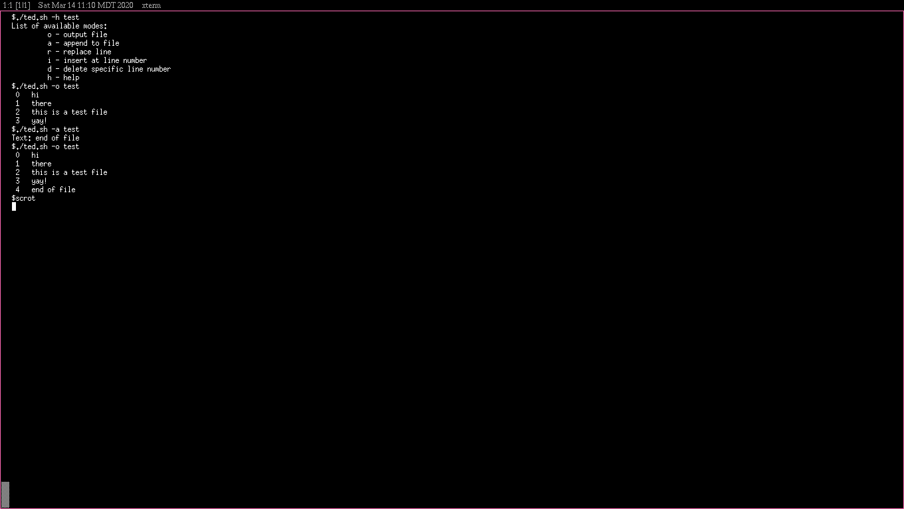

# ted
A line based text editor written for POSIX shells, using as few core utilities as possible.

## Why?
I have always wanted to write my own text editor, but after trying to learn curses and GNU Readline, 
I decided to write something more similar to ed (the standard editor). It just so happened that 
around the time I began poking around various text editors, I also started learning to pure SH 
scripts. This is by no means meant to be a text editor to replace any other out there, it was a simple 
learning excersize for myself. It is useful for making quick edits though, but I would not recommend 
doing any heavy editing with it. Also the name ted stands for **(T)**ravis' **(Ed)**itor. 

### Dependencies
* POSIX shell
* sed

### How to run
* To make run: `chmod +x ted.sh`
* Basic command is `./ted.sh`
* Useful to set as shell alias: `alias ted="./ted.sh"`

### Notes
* Arrow keys are not supported
* Has been tested on XTerm running OpenBSD
* Linted using shellcheck ( https://github.com/koalaman/shellcheck )
* To view large files use: `./ted.sh -o file-name | less -r`

### Screenshot

